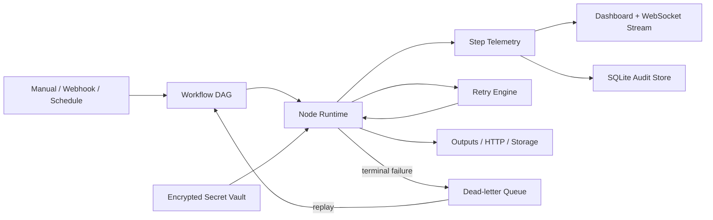

# OpsWeave

**Local-first workflow orchestration and reliability platform for API, data and business automation.**

OpsWeave is a compact control plane for teams that need more than one-off scripts. It models automations as DAGs, runs them from manual, webhook or scheduled triggers, records every step, retries transient failures, stores failed payloads in a dead-letter queue, and exposes live execution telemetry through a web dashboard and REST API.

The project is designed to look and behave like a small production automation platform rather than a demo script.

## Highlights

- Visual workflow DAGs with conditional branches
- Manual, webhook and scheduled triggers
- Retry policy with incremental backoff
- Step-level timing, input/output hashes and execution history
- Live run updates over WebSockets
- Dead-letter queue with safe replay
- Encrypted secret vault (`${SECRET:NAME}` references)
- REST API and built-in OpenAPI docs
- SQLite persistence with WAL mode and audit logs
- JSON artifact persistence for downstream handoff
- CSV export of run history
- Responsive dark operations dashboard
- Docker and docker-compose support
- Automated test suite and GitHub Actions workflow

## Architecture



## Built-in node types

| Node | Purpose |
|---|---|
| `trigger` | Entry point for a run |
| `set` | Add static fields to the execution payload |
| `transform` | Normalize, cast and map payload values |
| `validate` | Required fields, regex, range and allowed-value rules |
| `condition` | Route execution using boolean branch edges |
| `http` | Call external JSON APIs with retry support |
| `delay` | Pause a workflow step |
| `notify` | Add operational notifications to run context |
| `json_store` | Persist a normalized payload artifact |

## Demo workflows

`python scripts/seed_demo.py` creates three realistic workflows:

1. **Vendor Order Intake Guard** — webhook intake, normalization, contract validation, high-value branching and persistence.
2. **Nightly Data Quality Gate** — scheduled health snapshot with freshness SLA validation.
3. **API Sync Reliability Watch** — reusable sync quality workflow with retry and dead-letter protection.

## Quick start

```bash
python -m venv .venv
source .venv/bin/activate  # Windows: .venv\Scripts\activate
pip install -r requirements.txt
python scripts/seed_demo.py
uvicorn app.main:app --reload
```

Open:

- Dashboard: `http://127.0.0.1:8000`
- API docs: `http://127.0.0.1:8000/docs`
- Health: `http://127.0.0.1:8000/api/health`

## Trigger the demo webhook

```bash
curl -X POST http://127.0.0.1:8000/api/webhooks/vendor-orders \
  -H 'Content-Type: application/json' \
  -d '{
    "order_id": "PO-1042",
    "supplier": "Northstar Components",
    "amount": "7425.50",
    "currency": "usd",
    "contact_email": " OPS@NORTHSTAR.EXAMPLE "
  }'
```

The run will normalize the payload, validate it, classify it as high-value, attach a finance-review notification and persist the final artifact.

## Failure and recovery demo

Send an invalid email address to the webhook. The validation node retries according to its policy, the run ends as failed, and the original payload appears in **Dead letters** for replay after correction.

## Secret vault

Store a credential:

```bash
curl -X POST http://127.0.0.1:8000/api/secrets \
  -H 'Content-Type: application/json' \
  -d '{"name":"CRM_TOKEN","value":"secret-value"}'
```

Reference it inside a workflow node:

```json
{
  "headers": {
    "Authorization": "Bearer ${SECRET:CRM_TOKEN}"
  }
}
```

Secrets are encrypted before being written to SQLite. Secret values are never returned by list endpoints.

## Optional write API protection

Set `OPSWEAVE_WRITE_API_KEY`. When configured, workflow mutations, manual runs, replays and secret writes require:

```text
X-OpsWeave-Key: your-key
```

Webhook trigger routes stay independent so they can be used by external systems.

## Data model

OpsWeave stores:

- workflows and graph definitions
- run state and trigger metadata
- every node attempt, latency and payload hash
- encrypted secret material
- audit events
- webhook idempotency keys
- unresolved and replayed dead letters

SQLite runs in WAL mode, which keeps the local deployment simple while still supporting concurrent dashboard reads and workflow writes.

## Test suite

```bash
pytest -q
```

The tests cover graph execution and branching, retry behavior, dead-letter creation, secret encryption, workflow CRUD and the API health contract.

## Docker

```bash
docker compose up --build
```

Runtime state is stored under `./data` and survives container restarts.

## Project structure

```text
app/
  config.py        environment settings
  crypto.py        encrypted secret box
  db.py            SQLite schema and connection layer
  engine.py        DAG execution, retries and node runtime
  main.py          FastAPI, WebSocket, API and HTML routes
  models.py        workflow contracts
  repository.py    persistence layer
  scheduler.py     scheduled workflow runner
  templates/       operations UI
  static/          dashboard styling
scripts/
  seed_demo.py      realistic demo workflows
tests/              automated tests
```

## Why this project exists

A lot of automation work starts as a Python script and later needs reliability: schedules, retry behavior, observability, secrets, audit history and a way to replay failures. OpsWeave demonstrates that complete path in one self-contained project.
